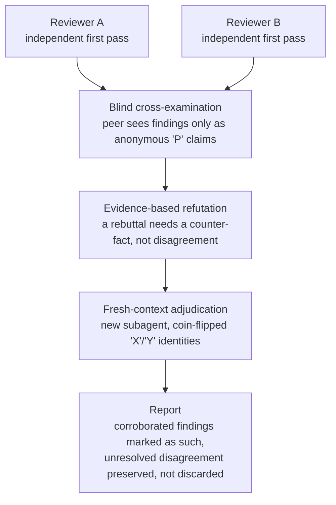

# SkillArray

A multi-model code and document review protocol for Claude Code, plus a
shared engineering-knowledge skill.

**Two models review the same target, then argue over each other's findings
before anything is reported settled.**

## Why this exists

A single model reviewing its own work tends to agree with itself, miss
what it wasn't looking for, and state guesses as confidently as verified
facts. SkillArray runs two independent reviewers against the same target,
blinds their identities from each other during cross-examination, and
requires actual evidence before a finding counts as settled. Agreement
alone doesn't cut it.

Two models reviewing separately and pasting the answers together still
leaves each model's false positives unchallenged, and gives no way to
tell whether an overlapping finding was discovered independently or just
copied from shared context. SkillArray's reviewers have to argue their
case with evidence, and only genuinely corroborating claims get merged.



## `pair-review` vs `cross-review`

- **`pair-review`** — two distinct Claude models review the same target,
  then exchange findings under identity blinding. Needs Claude Code
  access to two distinct models.
- **`cross-review`** — the same protocol across two different providers
  (Claude/Fable, Codex/OpenAI, or an OpenCode provider), so the reviewers
  don't share training data or failure modes. Needs Node.js 22+ and the
  selected runtimes.

## Identity blinding

A reviewer that knows which vendor wrote a claim can tailor its rebuttal
to the vendor instead of the evidence. So peer exchange is blinded by
actually relabeling the text, not just by instruction: provider, model,
and seat identity are stripped from what either reviewer and the auditor
ever see, and a scan hard-stops on any identity leak. That's a guarantee
against explicit leaks, not a claim that writing style can never hint at
who's who. That limit is real and it's documented, not hidden.

## Trust and privacy

Whatever you send to a reviewer goes to that reviewer's model provider
under that provider's terms. A reviewer can also execute commands from
the reviewed repository while checking a claim. See
[SECURITY.md](SECURITY.md) before running this against anything you
don't want a third-party model to see or run code against.

## What you get back

Run `/pair-review` or `/cross-review` against a target. You get a
human-readable report plus a machine-readable `findings.json` (see
`review-protocol.md` for the schema). Independently-corroborated findings
are marked as such. Unresolved disagreements are reported, not smoothed
over.

## Known limitations

No quality-improvement claim here is backed by a benchmark yet — that's
the current work in progress. See [CHANGELOG.md](CHANGELOG.md) for what's
shipped and [SECURITY.md](SECURITY.md) for the trust boundaries. There's
no defense against prompt injection from reviewed material.

## Included skills

| Skill | Purpose | Requirements |
|---|---|---|
| `pair-review` | Two distinct Claude models review the same target, then challenge each other. | Claude Code with two distinct models; Node.js 22+ |
| `cross-review` | Two different providers review independently and cross-examine findings. | Selected runtime(s); Node.js 22+ |
| `shared-brain` | Search, capture, and migrate durable engineering knowledge across projects. | Compatible MCP knowledge backend; Python 3.11+ |

## Install

```text
/plugin marketplace add M-khalifa/SkillArray
/plugin install reviews@skill-array
/plugin install shared-brain@skill-array
```

## Configure review models

First run asks for provider, runtime, model, and effort. Settings are
saved outside the repository and can be changed anytime; one-run
overrides don't touch saved preferences.

```text
/pair-review setup
/pair-review config
/cross-review setup
/cross-review config
```

## Repository layout

```text
SkillArray/
|-- .claude-plugin/marketplace.json
|-- plugins/
|   |-- reviews/skills/{pair-review,cross-review}/
|   `-- shared-brain/skills/shared-brain/
|-- bench/    (benchmark tooling, not part of either plugin)
|-- docs/     (design proposals and per-release engineering notes)
`-- .github/workflows/test.yml
```

Each review skill is independently installable — its own references,
scripts, tests, README, and license, no sibling skill required.

## Validate

Requirements: Node.js 22 or 24, plus Python 3.11 and PyYAML for Shared Brain.

```powershell
node scripts/release-check.mjs
```

Runs every release-readiness check in order and stops at the first
failure: conflict-marker scan, whitespace check, cross-package parity,
both packages' validators and test suites, the benchmark suites, and
Shared Brain's profile validation. Always run the full script instead of
individual steps. A package can pass its own tests while a shared file
has drifted from its sibling, and only this script's parity check
catches that.

```powershell
node scripts/release-check.mjs --release
```

`--release` additionally refuses a dirty working tree and re-runs each
skill from an isolated copy, so it can't pass just because it happens to
sit inside this monorepo.

To run one step alone instead of the full chain:

```powershell
node scripts/validate-repository.mjs

Push-Location plugins/reviews/skills/pair-review
node scripts/validate-package.mjs
node --test
Pop-Location

Push-Location plugins/reviews/skills/cross-review
node scripts/validate-package.mjs
node --test
Pop-Location

node --test bench/tests/score.test.mjs

python -m py_compile plugins/shared-brain/skills/shared-brain/scripts/scan_memory.py
python plugins/shared-brain/skills/shared-brain/scripts/scan_memory.py --check-profile plugins/shared-brain/skills/shared-brain/profiles/default.yml
```

CI runs the review packages on Windows, Linux, and macOS with Node.js 22
and 24.

## License

MIT. See [LICENSE](LICENSE).
